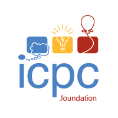

<h2> Hey there! I'm czHappy. </h2>

<h3> 👨🏻‍💻 About Me </h3>

- 🔭 &nbsp; I’m currently learning Computer Vision in 5G & Multimedia laboratory in BUPT.
- 🎓 &nbsp; Studying Computer Science, Programming, Deep Learning, Mechine Learning.
- 💼 &nbsp; Algorithm Development Engineer.
- 🌱 &nbsp; Enthusiast in software engineering and artificial intelligence, like to use interesting and powerful AI algorithms in software systems.
- 🕹 &nbsp; Movie, Chess, Pingpong, Fishing, Video Games...
- 📙 &nbsp;  DO IT NOW, YOUNG MAN. 

<h3>🛠 Tech Stack</h3>

- ⚡ &nbsp; C++ | Python | Java | C# | HTML | CSS 
- 🌐 &nbsp; Torch | OpenCV ｜Tensorflow
- 🚀 &nbsp; Algorithm | ML/DL | 
- 🛢 &nbsp; MySQL
- 🔧 &nbsp; VS Code | PyCharm | XCode | Eclipse | Git
- 🖥 &nbsp; Linux | Windows | Mac

        &nbsp;
        
        
        
        
        
        
        
        
        
        
        
        
        
        
        
        
        
        
        
    

 

 

<!--  -->

<h3> 🤝🏻 Connect with Me </h3>

&nbsp; 
&nbsp;   
&nbsp; 
&nbsp; 

